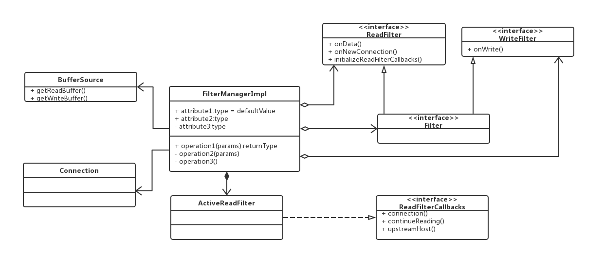

# Envoy 源码分析－－network L4 filter manager

>申明：本文的 Envoy 源码分析基于 Envoy1.10.0。

承接[Envoy 源码分析－－network](./envoy_network.md)，上次 network 只分析到 L4 过滤，这次接下来分析。

L4 过滤有三个不同类型的过滤器：

+ 读过滤：当 Envoy 从下游连接接收数据时，调用读过滤器。
+ 写过滤：当 Envoy 要发送数据到下游连接时，调用写过滤器。
+ 读/写过滤：当 Envoy 从下游连接接收数据和要发送数据到下游连接时，调用读/写过滤器。

网络级过滤器的 API 相对简单，因为最终过滤器只操作原始字节和少量连接事件（例如，TLS 握手完成、连接在本地或远程断开等）。

现在我们来分析下 L4 过滤的过滤管理，先看 UML 类图。

 

## FilterManagerImpl 

所有的 L4 filter FilterManager 都由 `FilterManagerImpl`  进行管理。它提供6个接口，其中 4个接口是和 `FilterManager` 一样。其余两个则是读和写。

### addWriteFilter

调用此接口，直接将其添加到下游过滤器。

```
void FilterManagerImpl::addWriteFilter(WriteFilterSharedPtr filter) {
  ASSERT(connection_.state() == Connection::State::Open);
  downstream_filters_.emplace_front(filter);
}
```

### addReadFilter

新建 `ActiveReadFilter`，加入下游过滤器。

```
void FilterManagerImpl::addReadFilter(ReadFilterSharedPtr filter) {
  ASSERT(connection_.state() == Connection::State::Open);
  ActiveReadFilterPtr new_filter(new ActiveReadFilter{*this, filter});
  filter->initializeReadFilterCallbacks(*new_filter);
  new_filter->moveIntoListBack(std::move(new_filter), upstream_filters_);
}
```

### addFilter

加入上游过滤器和下游过滤器

void FilterManagerImpl::addFilter(FilterSharedPtr filter) {
  addReadFilter(filter);
  addWriteFilter(filter);
}

### initializeReadFilters

初始化读过滤器，会调用各个过滤器的 `onNewConnection` 。

```
for (; entry != upstream_filters_.end(); entry++) {
  if (!(*entry)->initialized_) {
    (*entry)->initialized_ = true;
    FilterStatus status = (*entry)->filter_->onNewConnection();
    if (status == FilterStatus::StopIteration) {
      return;
    }
  }
```

### onRead

如果没有初始化调用 `onNewConnection`，然后获取读缓冲，对缓冲数据处理调用 `onData`。

```
  for (; entry != upstream_filters_.end(); entry++) {
    //未初始化，调用onNewConnection
    if (!(*entry)->initialized_) {
      (*entry)->initialized_ = true;
      FilterStatus status = (*entry)->filter_->onNewConnection();
      //需要过滤的数据，直接退出。
      if (status == FilterStatus::StopIteration) {
        return;
      }
    }

    BufferSource::StreamBuffer read_buffer = buffer_source_.getReadBuffer();
    if (read_buffer.buffer.length() > 0 || read_buffer.end_stream) {
      //调用onData进行处理
      FilterStatus status = (*entry)->filter_->onData(read_buffer.buffer, read_buffer.end_stream);
      //需要过滤的数据，直接退出。
      if (status == FilterStatus::StopIteration) {
        return;
      }
    }
  }
```

### onWrite

获取写缓冲，过滤写缓冲。

```
FilterStatus FilterManagerImpl::onWrite() {
  for (const WriteFilterSharedPtr& filter : downstream_filters_) {
    //获取写缓冲，调用onWrite
    BufferSource::StreamBuffer write_buffer = buffer_source_.getWriteBuffer();
    FilterStatus status = filter->onWrite(write_buffer.buffer, write_buffer.end_stream);
    if (status == FilterStatus::StopIteration) {
      return status;
    }
  }

  return FilterStatus::Continue;
}
```
